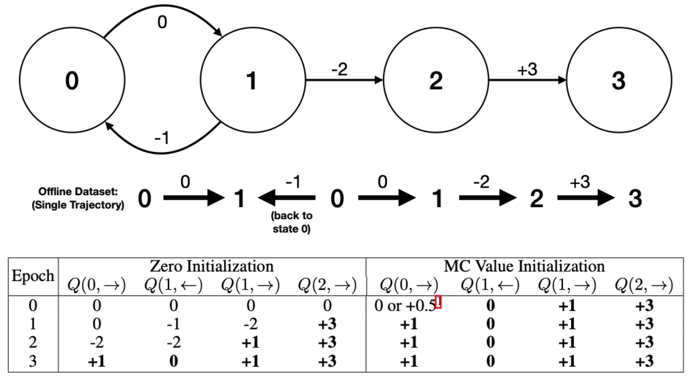

# Efficient Offline Reinforcement Learning:</br>The Critic is Critical

[](https://github.com/tinkoff-ai/CORL/blob/main/LICENSE)
[](https://github.com/psf/black)
[](https://pycqa.github.io/isort/)

This repository contains the codebase for the paper: Efficient Offline Reinforcement Learning: The Critic is Critical. This paper investigates improving the efficiency and stability of offline off-policy reinforcement learning algorithms (such as TD3+BC and EDAC) through supervised pre-training of both the actor and the critic to match the behavior policy.



[Installation Instructions](#installation)

This codebase builds on the excellent [CORL](https://github.com/tinkoff-ai/CORL) (Clean Offline Reinforcement Learning) codebase, which provided a solid foundation for this research and is highly recommended. In their own words:

> 🧵 [CORL](https://github.com/tinkoff-ai/CORL) is an Offline Reinforcement Learning library that provides high-quality and easy-to-follow single-file implementations of SOTA ORL algorithms. Each implementation is backed by a research-friendly codebase, allowing you to run or tune thousands of experiments. Heavily inspired by [cleanrl](https://github.com/vwxyzjn/cleanrl) for online RL, check them out too!<br/>
>
> * 📜 Single-file implementation
> * 📈 Benchmarked Implementation for N algorithms
> * 🖼 [Weights and Biases](https://wandb.ai/site) integration

Note that since this research was undertaken, the CORL codebase has been significantly improved and refactored (for example to include offline-to-online algorithms). This codebase does not include these updates in order to preserve the codebase that was used for our research and to prevent any discrepencies with results in the paper. However, if you are interested in continuing an aspect of this research it should be straightforward (ish!) to merge our changes into the latest CORL codebase. Feel free to raise an issue if you need any help with doing so.

Please note also that [ReBRAC](https://arxiv.org/abs/2305.09836) (developed concurrently with this research and now included in the updated CORL codebase) contains many similar auxiliary findings for improving the efficiency and stability of offline off-policy reinforcement learning algorithms (such as the use of layer normalization, deeper networks, and decoupled penalization on **both** the actor and critic) and is recommended as a base offline off-policy algorithm for future research. However, ReBRAC does **not** include any form of supervised pre-training to improve efficiency (the core contribution of our work).

## Installation

```bash
git clone git@github.com:AdamJelley/EfficientOfflineRL.git && cd EfficientOfflineRL
conda create -y -n EORL python=3.10
conda activate EORL
conda install -y -c conda-forge glew=2.1.0 glfw=3.3.10
pip install -r requirements.txt
```
Alternatively, you could use docker using the provided Dockerfile:
```bash
docker build -t <image_name> .
docker run gpus=all -it --rm --name <container_name> <image_name>
```

## MuJoCo Experiments (Section 5 of Paper)

To reproduce our results for TD3+BC on Hopper-medium:

```bash
python algorithms/td3_bc.py --config=configs/td3_bc/hopper/medium_v2.yaml --pretrain AC --pretrain_steps 10000 --td_component 0
```

Or for EDAC on Hopper-medium:

```bash
python algorithms/edac.py --config=configs/edac/hopper/medium_v2.yaml --pretrain softAC --pretrain_epochs 20 --td_component 0
```

Note these assume access to a CUDA device to run (otherwise set `--device cpu`).

Other environments can be run by changing the config. Hyperparameters can be changed either in the relevant config or overridden with arguments as above.

The pre-training argument can also be set to `--pretrain BC` to only pretrain the actor (corresponding to the ablation in Appendix D of the paper), or ignored to run the default algorithm without pre-training. LayerNorm can also be removed from the actor or critic with `--actor_LN False` and `--critic_LN False` respectively. For `pretrain_steps`, `td_component` (referred to as $\lambda$ in the paper) and other hyperparameters used please see the paper.

## Adroit Environments (Section 6 of Paper)

To run our hybrid algorithms TD3+BC+CQL and EDAC+BC introduced for improved stability on the Adroit environments:

```bash
python algorithms/td3_bc.py --config=configs/td3_bc/pen/human_v1.yaml --pretrain AC --pretrain_steps 200000 --pretrain_cql_regulariser 1 --cql_regulariser 1
```

```bash
python algorithms/edac.py --config=configs/edac/pen/human_v1.yaml --pretrain softAC --pretrain_epochs 200 --bc_regulariser 1
```

The additional regularisation components can be adjusted by changing the argument or in the config. For full details and hyperparameters please see Appendix G of the paper.

Note that performance on these environments is very high variance due to the limited data and and nature of the environment (particularly the shaping of the reward). Also note that we updated the evaluation procedure for these environments *for all algorithms* for fairer comparison, since we noticed that the timeout for these environments was set to be significantly shorter than the length of the provided demonstrations...! This is discussed in the paper in Appendix H.


## Citation

If you would like to cite our work on improving the efficiency and stability of offline off-policy algorithms, please use the following bibtex:

```bibtex
```

Otherwise, if you are interested in citing the CORL codebase, please use:

```bibtex
@inproceedings{
tarasov2022corl,
  title={{CORL}: Research-oriented Deep Offline Reinforcement Learning Library},
  author={Denis Tarasov and Alexander Nikulin and Dmitry Akimov and Vladislav Kurenkov and Sergey Kolesnikov},
  booktitle={3rd Offline RL Workshop: Offline RL as a ''Launchpad''},
  year={2022},
  url={https://openreview.net/forum?id=SyAS49bBcv}
}
```
